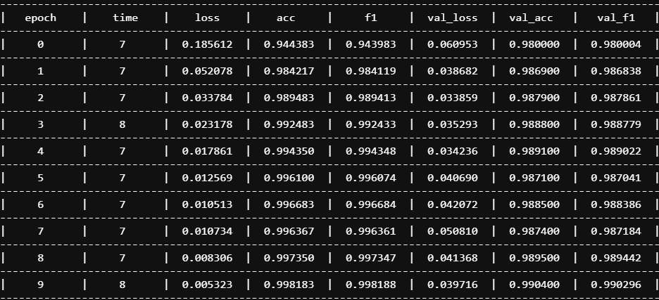
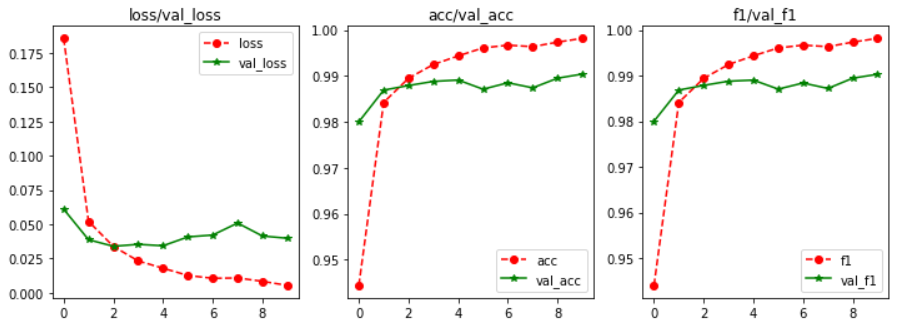

# MNIST手写数字分类

- 先导入一堆库

  ```python
  import torch
  import torch.nn.functional as F
  from torch import nn
  from torch.nn import *
  from torch.optim import *
  from torch.optim.lr_scheduler import *
  from torch.utils.data import Dataset, DataLoader
  from torchvision import datasets, transforms
  
  import pytorch_lightning as pl
  from pytorch_lightning.callbacks import Callback
  
  import os, gc, time
  import math, random
  import numpy as np
  import pandas as pd
  import matplotlib.pyplot as plt
  import seaborn as sns
  from tqdm import tqdm
  from sklearn.metrics import *
  ```

- 定义超参数

  ```python
  epochs = 10
  batch_size = 128
  ```

- 创建数据集和生成器

  ```python
  train_transform = transforms.Compose([
     transforms.ToTensor(),
     transforms.Normalize((0.1307,), (0.3081,))
  ])
  val_transform = transforms.Compose([
     transforms.ToTensor(),
     transforms.Normalize((0.1307,), (0.3081,))
  ])
  ```

  ```python
  train_dataset = datasets.MNIST("data", train=True, download=True, transform=train_transform)
  train_dataloader = torch.utils.data.DataLoader(train_dataset, batch_size=batch_size, shuffle=True, num_workers=4, pin_memory=True)
  
  val_dataset = datasets.MNIST("data", train=False, transform=val_transform)
  val_dataloader = torch.utils.data.DataLoader(val_dataset, batch_size=batch_size, shuffle=False, num_workers=4, pin_memory=True)
  ```

- 定义损失函数和指标

  ```python
  class CrossEntropyLoss(Module): # 和Pytorch官方实现一样
      def __init__(self):
          super().__init__()
  
      def forward(self, input, target, reduction="mean"):
          N, C = input.size()
  
          if target.dim() > 1:
              one_hot = target
          else:
              one_hot = torch.zeros((N, C), dtype=input.dtype, device=input.device)
              one_hot.scatter_(1, target.reshape(N, 1), 1)
  
          loss = -(one_hot * F.log_softmax(input, 1)).sum(1)
          if reduction == "mean":
              return loss.mean(0)
          elif reduction == "sum":
              return loss.sum(0)
          else:
              return loss
  
  
  class ClassificationMetric(object): # 记录结果并计算指标
      def __init__(self, accuracy=True, recall=True, precision=True, f1=True, average="macro"):
          self.accuracy = accuracy
          self.recall = recall
          self.precision = precision
          self.f1 = f1
          self.average = average
  
          self.preds = []
          self.target = []
  
      def reset(self): # 重置结果
          self.preds.clear()
          self.target.clear()
          gc.collect()
  
      def update(self, preds, target): # 更新结果
          preds = list(preds.cpu().detach().argmax(1).numpy())
          target = list(target.cpu().detach().argmax(1).numpy()) if target.dim() > 1 else list(target.cpu().detach().numpy())
          self.preds += preds
          self.target += target
  
      def compute(self): # 计算结果
          metrics = []
          if self.accuracy:
              metrics.append(accuracy_score(self.target, self.preds))
          if self.recall:
              metrics.append(recall_score(self.target, self.preds, labels=list(set(self.preds)), average=self.average))
          if self.precision:
              metrics.append(precision_score(self.target, self.preds, labels=list(set(self.preds)), average=self.average))
          if self.f1:
              metrics.append(f1_score(self.target, self.preds, labels=list(set(self.preds)), average=self.average))
          self.reset()
          return metrics
  ```

- 定义模型和训练逻辑

  ```python
  class CustomModel(pl.LightningModule):
      def __init__(self):
          super().__init__()
          # 定义网络层
          self.conv1 = Conv2d(1, 10, 5)
          self.conv2 = Conv2d(10, 20, 3)
          self.fc1 = Linear(20*10*10, 500)
          self.fc2 = Linear(500, 10)
          # 定义损失函数
          self.train_criterion = CrossEntropyLoss()
          self.val_criterion = CrossEntropyLoss()
          # 定义指标
          self.train_metric = ClassificationMetric(recall=False, precision=False)
          self.val_metric = ClassificationMetric(recall=False, precision=False)
          # 定义log
          self.history = {
              "loss": [], "acc": [], "f1": [],
              "val_loss": [], "val_acc": [], "val_f1": [],
          }
          
      def forward(self,x):
          in_size = x.size(0)
          out = self.conv1(x)
          out = F.relu(out)
          out = F.max_pool2d(out, 2, 2)
          out = self.conv2(out)
          out = F.relu(out)
          out = out.view(in_size, -1)
          out = self.fc1(out)
          out = F.relu(out)
          out = self.fc2(out)
          out = F.log_softmax(out, dim=1)
          return out
      
      def training_step(self, batch, idx):
          x, y = batch
          _y = self(x)
          # 计算loss
          loss = self.train_criterion(_y, y)
          # 更新结果
          self.train_metric.update(_y, y)
          return loss
  
      def training_epoch_end(self, outs):
          # 计算平均loss
          loss = 0.
          for out in outs:
              loss += out["loss"].cpu().detach().item()
          loss /= len(outs)
          # 计算指标
          acc, f1 = self.train_metric.compute()
          # 记录log
          self.history["loss"].append(loss)
          self.history["acc"].append(acc)
          self.history["f1"].append(f1)
  
      def validation_step(self, batch, idx):
          x, y = batch
          _y = self(x)
          val_loss = self.val_criterion(_y, y)
          self.val_metric.update(_y, y)
          return val_loss
  
      def validation_epoch_end(self, outs):
          val_loss = sum(outs).item() / len(outs)
          val_acc, val_f1 = self.val_metric.compute()
  
          self.history["val_loss"].append(val_loss)
          self.history["val_acc"].append(val_acc)
          self.history["val_f1"].append(val_f1)
  
      def configure_optimizers(self):
          # 设置优化器
          return Adam(self.parameters())
  ```

  ```python
  model = CustomModel()
  ```

- 定义进度条和学习曲线（我不喜欢官方的进度条，所以自己写了一个）

  ```python
  class FlexibleTqdm(Callback):
      def __init__(self, steps, column_width=10):
          super(FlexibleTqdm, self).__init__()
          self.steps = steps
          self.column_width = column_width
          self.info = "\rEpoch_%d %s%% [%s]"
  
      def on_train_start(self, trainer, module):
          history = module.history
          self.row = "-" * (self.column_width + 1) * (len(history) + 2) + "-"
          title = "|"
          title += "epoch".center(self.column_width) + "|"
          title += "time".center(self.column_width) + "|"
          for i in history.keys():
              title += i.center(self.column_width) + "|"
          print(self.row)
          print(title)
          print(self.row)
  
      def on_train_batch_end(self, trainer, module, outputs, batch, batch_idx, dataloader_idx):
          current_index = int((batch_idx + 1) * 100 / self.steps)
          tqdm = ["."] * 100
          for i in range(current_index - 1):
              tqdm[i] = "="
          if current_index:
              tqdm[current_index - 1] = ">"
          print(self.info % (module.current_epoch, str(current_index).rjust(3), "".join(tqdm)), end="")
  
      def on_epoch_start(self, trainer, module):
          print(self.info % (module.current_epoch, "  0", "." * 100), end="")
          self.begin = time.perf_counter()
  
      def on_epoch_end(self, trainer, module):
          self.end = time.perf_counter()
          history = module.history
          detail = "\r|"
          detail += str(module.current_epoch).center(self.column_width) + "|"
          detail += ("%d" % (self.end - self.begin)).center(self.column_width) + "|"
          for j in history.values():
              detail += ("%.06f" % j[-1]).center(self.column_width) + "|"
          print("\r" + " " * 120, end="")
          print(detail)
          print(self.row)
          
          
  class LearningCurve(Callback):
      def __init__(self, figsize=(12, 4), names=("loss", "acc", "f1")):
          super(LearningCurve, self).__init__()
          self.figsize = figsize
          self.names = names
  
      def on_fit_end(self, trainer, module):
          history = module.history
          plt.figure(figsize=self.figsize)
          for i, j in enumerate(self.names):
              plt.subplot(1, len(self.names), i + 1)
              plt.title(j + "/val_" + j)
              plt.plot(history[j], "--o", color='r', label=j)
              plt.plot(history["val_" + j], "-*", color='g', label="val_" + j)
              plt.legend()
          plt.show()
  ```

- 设置训练参数（我不喜欢用logger，所以全关闭了）

  ```python
  trainer_params = {
      "gpus": 1,
      "max_epochs": epochs,  # 1000
      "checkpoint_callback": False,  # True
      "logger": False,  # TensorBoardLogger
      "progress_bar_refresh_rate": 0,  # 1
      "num_sanity_val_steps": 0,  # 2
      "callbacks": [
          FlexibleTqdm(len(train_dataset) // batch_size, column_width=12), # 注意设置progress_bar_refresh_rate=0，取消自带的进度条
          LearningCurve(figsize=(12, 4), names=("loss", "acc", "f1")),
      ],  # None
  }
  trainer = pl.Trainer(**trainer_params)
  ```

- 开启训练

  ```python
  trainer.fit(model, train_dataloader, val_dataloader)
  ```

# 训练结果



