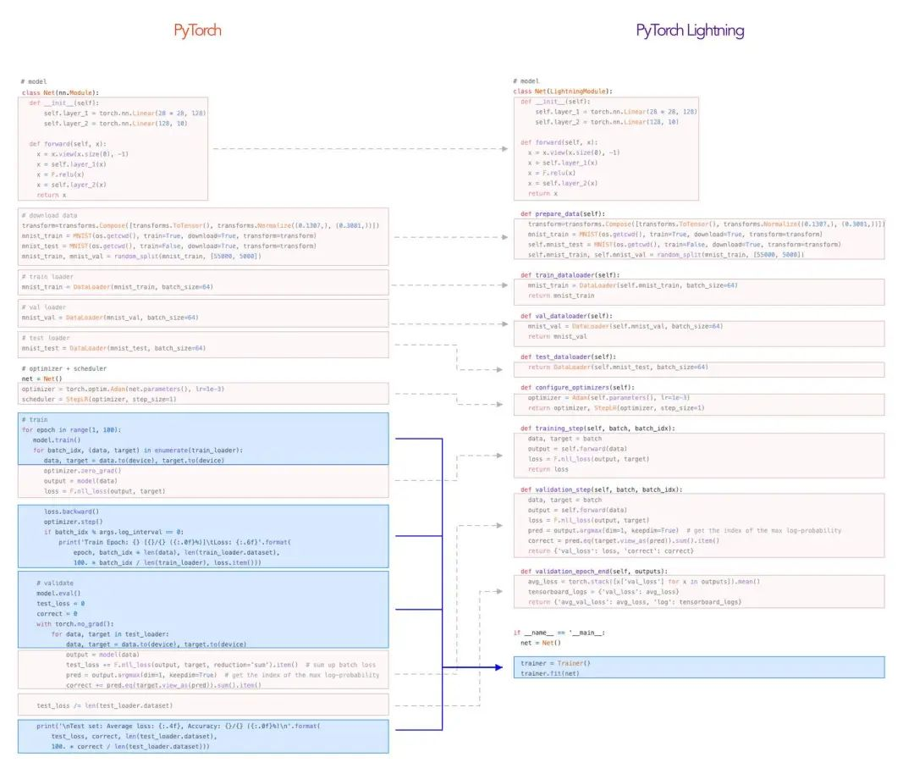

# 引言

唠嗑唠嗑笔者的深度学习历程：

- 2019年夏天，笔者申报了一个项目，随便买了一本Keras之父的《Python深度学习》，就此开启了我的深度学习之路。Keras给我的第一印象就是漂亮，简单的模型搭建和训练，啪的一下，上手很快啊，我开始使用Keras打比赛，慢慢的，代码需求越来越大，自定义模型、自定义指标和损失函数、自定义进度条，各种自定义使我不断地深入学习Keras的各种逻辑实现，我依旧觉得万事皆可Callback（Keras的Callback抽象类）。2019年到了冬天，我参加了Kaggle的“孟加拉字素识别”，打了两个月，连铜牌也没有，打了个寂寞，但我感受到了Pytorch的流行和灵活。我开始学习Pytorch，但通过Keras入门深度学习的我就感觉：太麻烦了，太麻烦了，不学了。实际上是因为我用Pytorch进行鲜花分类loss一直不收敛，又找不到bug，糟心放弃了。
- 2020年上半年Tensorflow2和TPU又开始火了，而且Tensorflow2集成了Keras，我赶紧学了学，说实话还不错，相比于Keras，解决了启动慢的问题和一些奇怪的bug，还可以自己编写逻辑，最好的地方在于tf2的Dataset是真的快，训练飞速，在6月份还得了个CV赛的第一。但更多问题出现了，tf2无法复现模型（tf2.3以上设置单线程好像可以），去官方仓库看了看，无法解决，心态崩了。
- 2020年下半年，笔者参加了华录杯，初赛中期发现了一个Pytorch的高分baseline，想着用tf2复现一下方案。baseline用的是ImageNet的文件结构，看得令人很糟心，可读性极低，导致我对Pytorch愈发讨厌。同时我复现失败了，因为差分训练和tf2的Dataset不支持numpy（别说什么tf.py_function支持numpy，tf.py_function效率代价心里没b数吗？），我对Tensorflow2失望了。
- 2020年国庆节，笔者看见了一篇微信推送《PyTorch Lightning 1.0版发布，终于可以抛弃Keras》，好家伙，想什么来什么，学了一波，第一感觉就是Pytorch和Keras一起生出来的一样，还可以当作插件放在Pytorch代码中，我的内心告诉我，就是它了。

PyTorch Lightning的精华主要在两个模块LightningModule和Trainer，其他API包括Accelerators、Callback、LightningDataModule、Logging、Metrics和Plugins。其中Accelerators和Plugins几乎用不到，Callback应该很眼熟吧，就和Keras的Callback差不多，但功能更丰富，逻辑更灵活，LightningDataModule是数据模块，Logging是个日志模块，Metrics是指标模块。**最重要的来了，LightningDataModule、Logging、Metrics都是垃圾，不要学！不要学！不要学！我们只学LightningModule、Trainer和Callback**，附上[官方教程](https://pytorch-lightning.readthedocs.io/en/latest/)。

# 环境搭建

两步：

- [装Pytorch](https://pytorch.org/get-started/locally/) >=1.3
- 装PyTorch Lightning（与硬件无关，Pytorch是CPU版，那就是CPU，否则就是GPU）
  - pip install pytorch-lightning
  - conda install pytorch-lightning

# 整体结构

简单说来，就三个步骤：

- 用Pytorch的Dataset和DataLoader定义数据集。

- 用LightningModule定义模型并实现训练逻辑。
- 用Trainer配置参数进行自动训练。

Pytorch到Pytorch Lightning如下图（有点糊）：

如果还不懂可以看看下面这个动图：

# 兼容关系

- PyTorch Lightning完全继承于Pytorch，Pytorch的所有东西都可以在PyTorch Lightning中使用，PyTorch Lightning的所有物品也可在Pytorch中使用。
- PyTorch Lightning作为Pytorch的高级封装，内部包含着完整且可修改的训练逻辑。
- PyTorch Lightning的硬件检测基于Pytorch，也可以使用Trainer修改。
- PyTorch Lightning中数据类型自动变化，无需.cpu和.cuda。